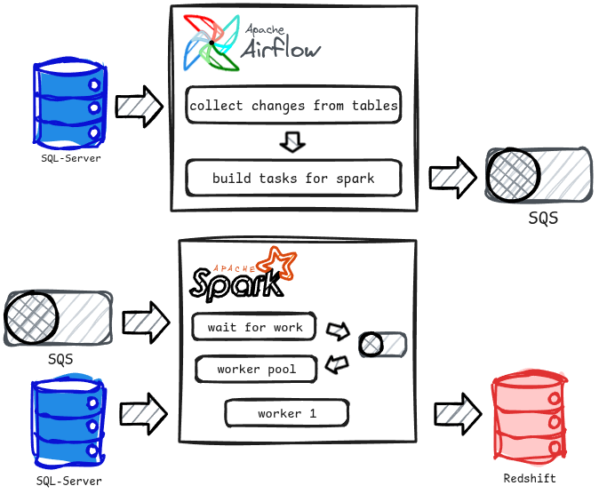

# SQL-Server to Redshift CDC tool

## Challenge

Develop a new tool to replace an existing low-code tool that performed the same function but at a higher cost.

### Implementation

Tasks:
- Design the new tool in collaboration with one of the data engineers who was working with the old tool.

- Help in the implementation.

#### Solution

This tool was design to combine tasks from Airflow and Spark. Airflow identifies tables that have changes requiring synchronization and sends this information to Spark via SQS queues. Spark is responsible do fetch the changes from SQL-Server and send it to Redshift.

NOTE: All client and project information was changed to respect privacy.
