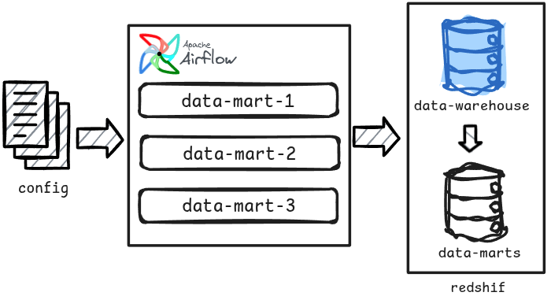

# Data-mart tool

## Challenge

Implement a mechanism that could build data-marts without moving data outside the data-warehouse. This restriction is important because moving data from and into redshift is expensive in terms of computation.

### Implementation

Tasks:
- Design and implement a solution that could deal with the imposed redshift restrictions and at the same time make the tool as flexible as possible for the data engineers to be able to configured the same way they do for the other applications and not be forced to work within Redshift.

#### Solution

For this case we followed a different approach, instead of creating a application, we developed a library that is loaded by the airflow DAG tasks and each task will load a temporary procedure to Redshift and then executes it. With this approach all operations run inside redshift saving computation costs of moving data outside.

