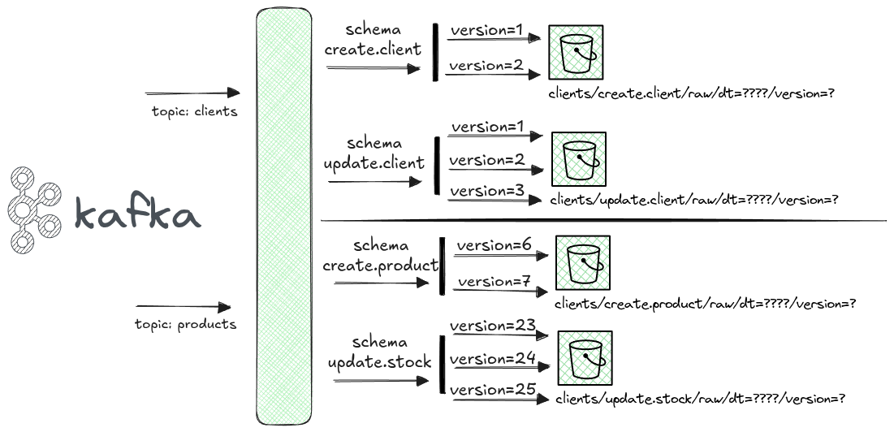
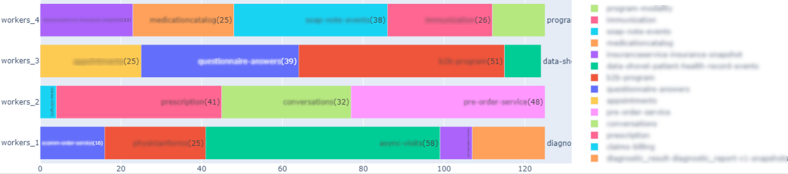
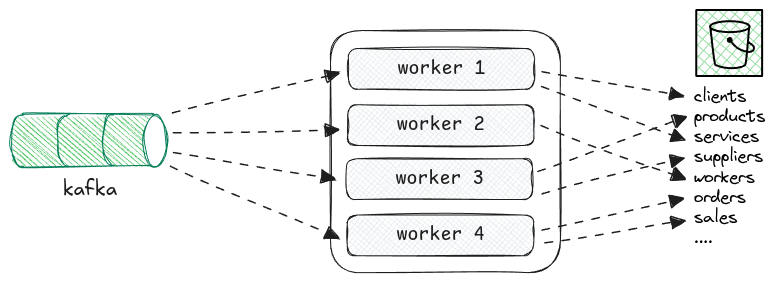

# kafka streaming tool

## Challenge

Each topic contained different data sources and the schema of each data sources would evolve in terms of adding,removing and change the data type of columns.

### Implementation

Tasks:
- design the tool that would consume the data taking in consideration the way the data is sent by each topic.

- Implement the first prototype

- Help in implementation of the application

Below is a image that illustrates how the application works.

### Improvements:

After we start to receive some topics with large volumes of data some of the workers start to fail and force the application to 

#### Improvements (2023):

- Readjust the limit of events that each topic could receive.
- Cache some of the data-frames of some stages that where uses times.
- Add additional metrics to control the execution time of each individual topic data source.

#### Improvements (2024)

- Design and develop a auxiliary tool that uses a scheduling algorithm to automatically groups topics by workers according to the execution time that each topic was taking.

    Below is a visual representation of how topics would be distributed by 4 streaming worker jobs, and a representation of how the workers extract data from topics.

    

    

NOTE: All paths and "business" names were changed