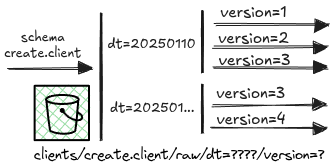
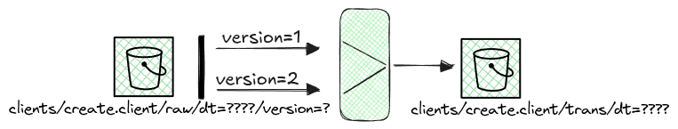

# Stream data transformation tool

## Challenge

Convert the stored streamed data in a format that is more easy to review and explore (data is nested with multiple layers inside on just one column), additionally because there is a large number of schema transformations it was very difficult to query the data as it is. The image below illustrates this situation.

## Implementation (2022)

Tasks:

- Design a solution to solve this two problems.

- Support the implementation of that solution.

### Solution

To make the data more readable the nested structured apart from lists where all flatten and converted to columns at the root level of the table. The lists where converted into tables with keys to connect to the main table, additionally all "business" columns columns where converted into strings, this adds extra cost to the consumers of data but at the same time makes the data readable even if column A was a datetime string then after some time it was received as a number.

### Improvements:

#### Improvements (2023):

With the increase of the volumes of some tables the process started to decrease performance of these jobs so it was necessary to refactor some parts of the tool:

Tasks:
- Cache data-frames that are used multiple times.
- Refactor the code on some components.
- Add python a multi thread pool to increase the number of tables that are transformed in parallel(this required allot of tests to be feasible).

#### Improvements (2024):

Because we started to consume data not just from kafka but from APIs and other data producers it was necessary to refactor the tool in a way that could read from different data sources and produce the same resolve.

- Design and develop a second version of the transformation tool where now we can define in a configuration file all the components needed to transform the data.
